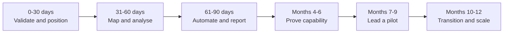

# 12-Month Roadmap

| Phase | Outcome | Key actions | Evidence / gate |
|---|---|---|---|
| 0–30 days | Confirm target roles, baseline capability and learning cadence. | Career consultation, role shortlist, data diagnostic, automation diagnostic, CV/LinkedIn refresh and process selection. | Approved IDR, baseline scores, target-role matrix and first mentor review. |
| 31–60 days | Create a reliable operational baseline. | Map current/future process, define owners and risks, inventory data sources and define 8–12 KPIs. | Process maps, SOP draft, data inventory, KPI dictionary and 60-day review. |
| 61–90 days | Demonstrate applied automation and decision support. | Build one controlled workflow and one dashboard; document testing, permissions and exceptions. | Working prototype, test log, executive briefing and 90-day go/adjust decision. |
| Months 4–6 | Complete structured learning and publish sanitised evidence. | Finish selected milestones, refine artefacts, present to stakeholders and complete a second project. | Two portfolio artefacts, one credential milestone and reviewer feedback. |
| Months 7–9 | Lead a small improvement initiative. | Define charter, baseline, owners and benefits; facilitate reviews; manage risk; measure results. | Pilot report, benefits dashboard, lessons learned and leadership evidence. |
| Months 10–12 | Secure a stronger role or expanded responsibility. | Targeted applications or internal progression, interview practice, portfolio presentation and annual review. | Updated role or transition plan, final capability review and next roadmap. |

## Decision gates

- **30 days:** Is the target-role direction credible and sustainable?
- **60 days:** Is the process/data baseline sufficient for a prototype?
- **90 days:** Does the workflow and dashboard demonstrate capability and safe execution?
- **6 months:** Is the evidence strong enough for market positioning or expanded responsibility?
- **9 months:** Has Fernanda led an initiative with measured results?
- **12 months:** Has the pathway produced role progression or a clear next transition plan?
